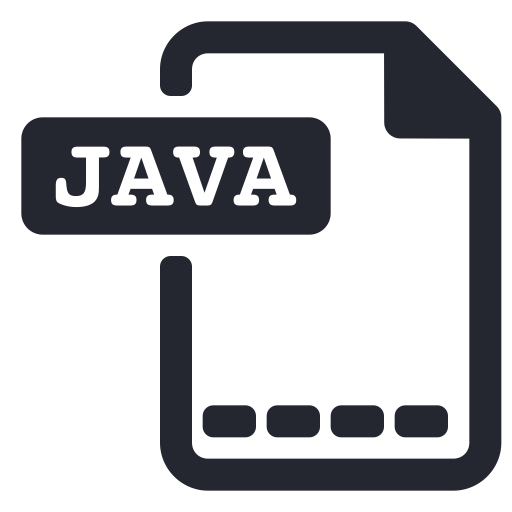

<h1 align="center">Basic Java Course - <a href="https://youtu.be/q3JfB203agk" target="_blank">Youtube</a></h1>

    

 <a href="#status">Status</a> • 
 <a href="#objetivo">Objective</a> •
 <a href="#instalacao">Installation</a> • 
 <a href="#tecnologias">Technology</a> • 
 <a href="#autor">Author</a> .
 <a href="#licenca">License</a> • 

<h2 align="center" id=status> 
	:beginner: Initiated :beginner:
</h2>

<h2 id=objetivo>:scroll: Objective</h2>
The goal is to learn to work with Java

<h2 id=instalacao>:clipboard: Installation</h2>

1. Clone the repo.
2. Install Visual Studio and Eclipse.

<h2 id=tecnologias>:toolbox: Technology</h2>

The following tools were used in the construction of the project:

- IDE: <a href="https://code.visualstudio.com/download">Visual Studio Code</a> | <a href="https://www.eclipse.org/downloads/">Eclipse v2020-12</a>
- JDK: <a href="https://www.oracle.com/technetwork/pt/java/javase/downloads/index.html">Java JDK 15.0.2</a>

<h2 id=autor>:grin: Author</h2>

Developed by <a href="https://www.linkedin.com/in/danhpaiva/" target="_blank">Daniel Paiva</a>

<h2 id=licenca>:lock: Licence</h2>
<a href="https://github.com/danhpaiva/course-basic-java-JdA/blob/main/LICENSE" target="_blank">MIT</a>
